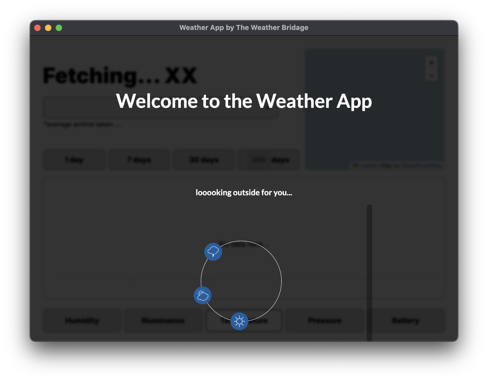
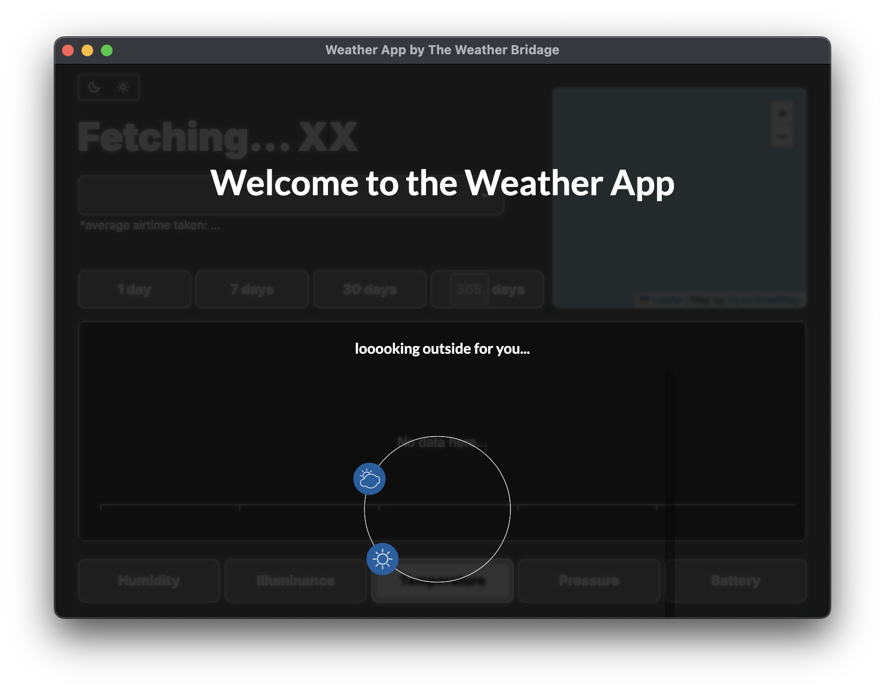
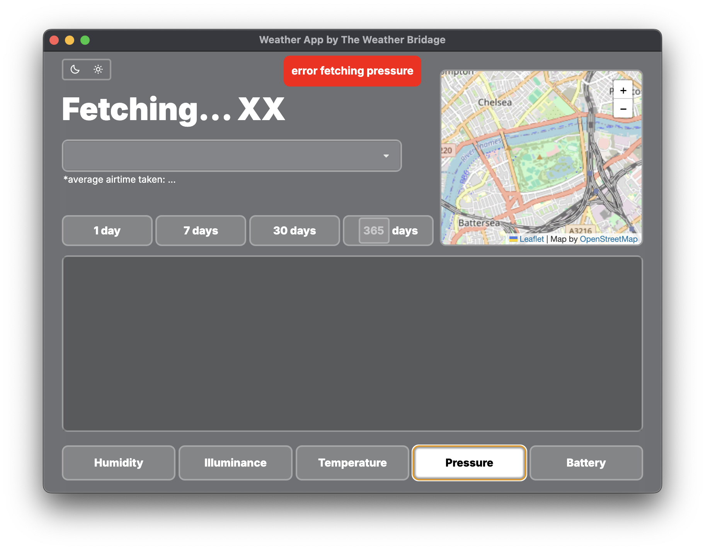
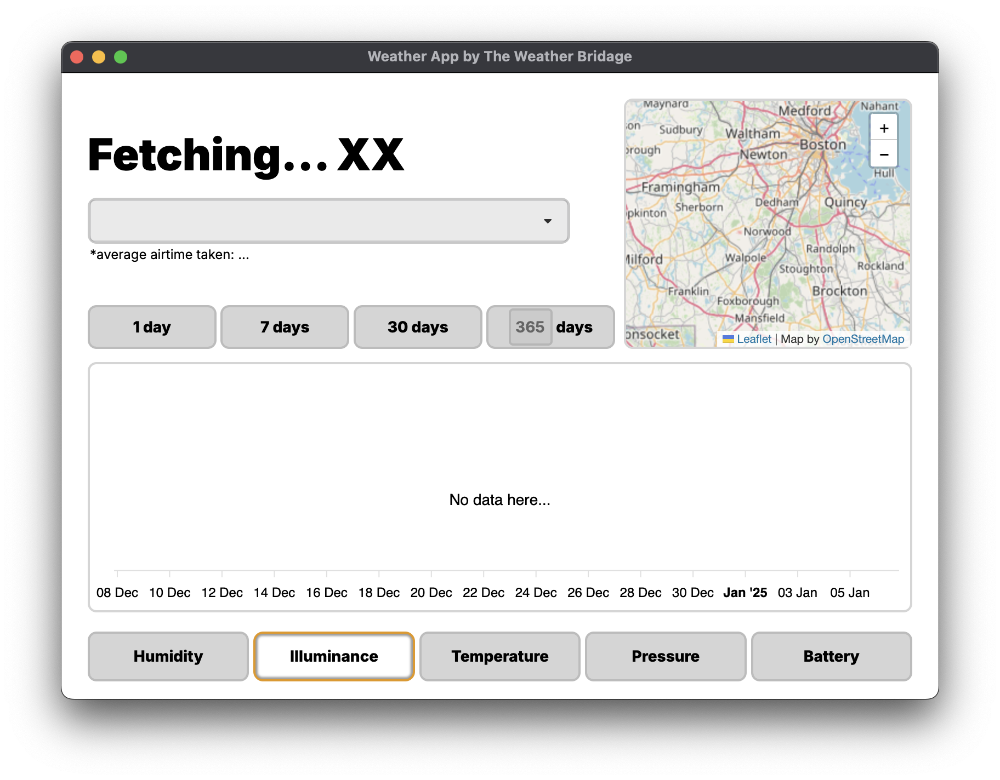
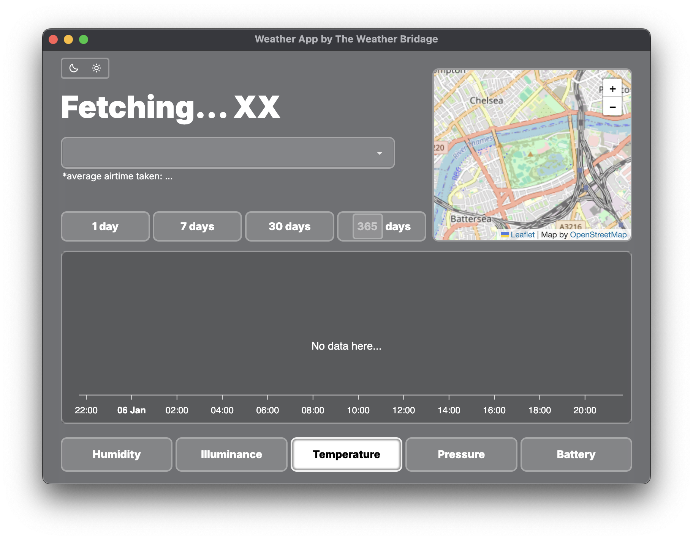
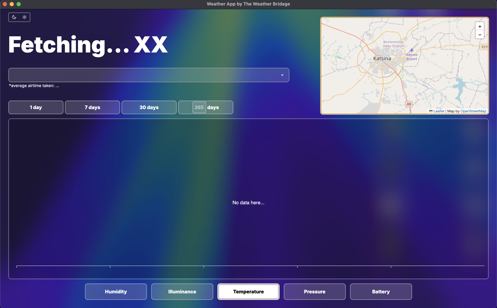

# TheWeatherBrigade

**TheWeatherBrigade** is a cross-platform Electron application for Windows and macOS that visualizes environmental data—humidity, temperature, illuminance, pressure, and battery levels—over selected time frames and locations.

## Features

- **Real-Time Data Visualization**: Displays graphs for humidity, temperature, illuminance, pressure, and battery levels.
- **Historical Data Analysis**: Allows selection of specific time frames to review past environmental conditions.
- **Multi-Location Support**: Enables monitoring of multiple locations simultaneously.

## Installation

1. **Clone the Repository**:

   ```bash
   git clone https://github.com/AZaUk/TheWeatherBrigade.git
    ```
   
2. **Navigate to the Project Directory**:
    ```bash
    cd TheWeatherBrigade
   ```

3. **Install Dependencies**:
    <br>Ensure you have Node.js installed, then run:
    ```bash
    npm install
    ```

4. **Run the Application**:
    ```bash
    npm start
   ```

## Usage

- **Launching**: After installation, execute npm start to open the application.
- **Selecting Time Frames**: Use the time-frame selector to choose the period for data visualization.
- **Choosing Locations**: Input desired locations to monitor environmental data for multiple areas.

## App Screenshots

Experience the elegant and intuitive interface of the Weather App, crafted to provide a seamless user experience. Below are some glimpses of the application in action:

- **Welcome Screen**: A clean and minimalistic introduction to the Weather App, as it fetches the latest weather data for you.
  
  

- **Error Message Handling**: Observe the app's ability to gracefully handle errors, ensuring clarity in communication.
  

- **Detailed Metrics**: Navigate through various metrics like illuminance, temperature, pressure, and more, displayed alongside an interactive map.
  
  

- **Responsive Design with Glassmorphic Window on Mac**:
  

## Contributing

Contributions are welcome! Please follow these steps:

1. Fork the Repository.
2. Create a New Branch:
    ```bash
   git checkout -b feature/YourFeatureName
   ```

3. Commit Your Changes:
    ```bash
    git commit -m 'Add some feature'
   ```

4. Push to the Branch:
    ```bash
    git push origin feature/YourFeatureName
   ```

5. Open a Pull Request.

## License

This project is licensed under the MIT License. See the LICENSE file for details.

## Contact

For questions or suggestions, please open an issue in this repository.